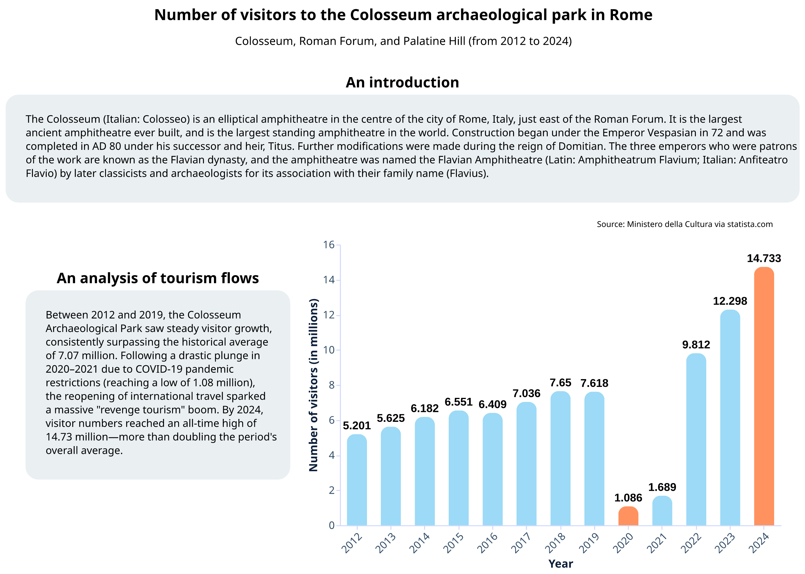
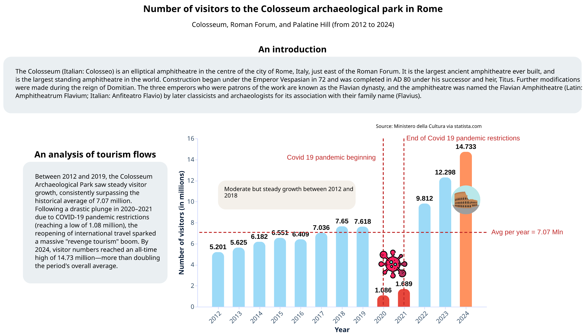
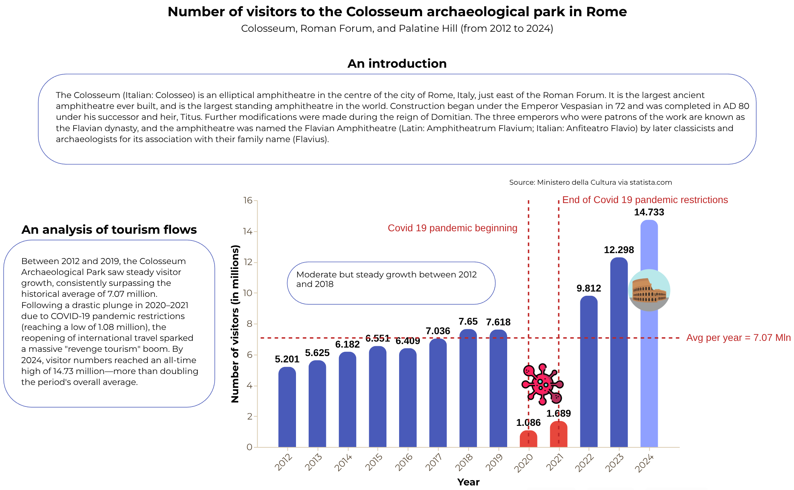

# Pynarrative: Transform Data Visualizations into Stories

## Installation

Pynarrative can be easily installed using **pip**, Python's package manager. To install the library, run the following command in your terminal:

```bash
pip install pynarrative
```

## Core API Reference
**Full technical documentation [here](https://pynarrative.github.io/doc/site/api/)**

```python
Story(
    data=None,
    width=None,
    height=None,
    font=None,
    base_font_size=None,
    template=None,
    geodata=False,
    geojson_url=None,
    geojson_property=None,
    geo_property=None,
    geo_value=None,
    **kwargs
)

add_title(
    title,
    subtitle=None,
    background_color=None,
    color=None, align='center',
    img_url=None,
    img_width=80,
    x_img_offset=-300,
    y_img_offset=0
)

add_context(
    text,
    text_align='left',
    position='left',
    align='middle',
    font_weight='normal',
    font_style='normal',
    title='CONTEXT',
    title_dy=0,
    img_url=None,
    img_width=60,
    x_img_offset=-40,
    y_img_offset=0
)

add_next_steps(
    steps,
    text_align='left',
    position='bottom',
    title='NEXT STEPS',
    title_dy=0,
    title_dx=0,
    mode='horizontal',
    img_url=None,
    img_width=45,
    x_img_offset=-50,
    y_img_offset=-22.5
)

add_source(
    text,
    position='top',
    vertical=False,
    align='center'
)

add_annotation(
    x=None,
    y=None,
    text=None,
    title=None,
    dx=0,
    dy=0,
    background_color=None,
    text_color=None,
    how_subject=False,
    line_point_color=None,
    img_url=None,
    img_width=60,
    x_img_offset=0,
    y_img_offset=0
)


add_line(
    value,
    orientation='horizontal',
    math=None,
    color='',
    label_text='',
    label_dx=0,
    label_dy=0,
    label_font_size='',
    label_font_weight='normal',
    label_font_style='normal'
)


render(
    save=False,
    filename=None,
    ppi=False
)

```

## Overview

Pynarrative is a Python library designed to transform data visualizations into engaging narratives. Built as an extension of Altair, pynarrative provides a powerful set of tools for creating interactive, narrative-driven visualizations that engage and inform your audience. The library bridges the gap between raw data visualization and storytelling by introducing narrative elements such as **contextual** descriptions, **annotations** and **nextsteps**.

## Architecture

Pynarrative is built around the **Story class**: it serves as the core component, handling the creation and management of narrative visualizations. It extends Altair's functionality while maintaining full compatibility with its declarative API.

The library requires Python 3.6 or later and depends on the following packages:

```bash
altair
pandas
geopandas
```

These dependencies will be automatically installed if they're not already present in your environment.

## Getting Started
<!-- RIVEDERE -->

PyNarrative is designed to be intuitive while providing powerful narrative capabilities. Here are two comprehensive examples showcasing both basic usage and advanced features:

### Basic Example


```python

import pandas as pd
import pynarrative as pn
import altair as alt

colosseum = pd.DataFrame({
    "year" : [2012, 2013, 2014, 2015, 2016, 2017, 2018, 2019,
             2020, 2021, 2022, 2023, 2024],
    "visitors" : [5.201, 5.625, 6.182, 6.551, 6.409, 7.036, 7.650, 7.618,
                 1.086, 1.689, 9.812, 12.298, 14.733]
})

story = (
    pn.Story(
    #Builing the Story class object
        data = colosseum,
        width = 550,
        height = 350,
        #Not using any template, pynarrative will apply its defaultTemplate,
        #with default colors and dimensions
    )

    #Method invocation and chaining
    #Plotting a bar chart
    .mark_bar(
        cornerRadiusEnd = 10, #With the rounded ends of the bars
        size = 25 #Of a specified size
    )

    #Data encoding
    .encode(
        x = alt.X(
            "year:O", #'year' is an ordinal category (:O)
            title = "Year", 
            axis = alt.Axis(
                labelAngle = -45
            )
        ),
        y = alt.Y(
            "visitors:Q", #'visitors' is a quantity (:Q)
            title = "Number of visitors (in millions)",
        )
    )

    #Data source
    .add_source(
        text = "Source: Ministero della Cultura via statista.com",
        position = "top",
        align = "right"
    )
    
    #Title and subtitle
    .add_title(
        title = "Number of visitors to the Colosseum archaeological park in Rome",
        subtitle = "Colosseum, Roman Forum, and Palatine Hill (from 2012 to 2024)",
        align = "center",
    )

    #Context area (on top)
    .add_context(
        position = "top",
        title = "An introduction",
        text = """The Colosseum (Italian: Colosseo) is an elliptical amphitheatre in
                the centre of the city of Rome, Italy,just east of the Roman Forum. It is
                the largest ancient amphitheatre ever built, and is the largest standing
                amphitheatre in the world. Construction began under the Emperor Vespasian
                in 72 and was completed in AD 80 under his successor and heir, Titus.
                Further modifications were made during the reign of Domitian. The three
                emperors who were patrons of the work are known as the Flavian dynasty,
                and the amphitheatre was named the Flavian Amphitheatre (Latin:
                Amphitheatrum lavium; Italian: Anfiteatro Flavio) by later classicists and
                archaeologists for its association with their family name (Flavius)."""

    )

    #Context area (on the left)
    .add_context(
        position = "left",
        title = "An analysis of tourism flows",
        text = """Between 2012 and 2019, the Colosseum Archaeological Park saw steady
                visitor growth, consistently surpassing the historical average of 7.07
                million. Following a drastic plunge in 2020–2021 due to COVID-19
                pandemic restrictions (reaching a low of 1.08 million), the reopening
                of international travel sparked a massive \"revenge tourism\" boom.
                By 2024, visitor numbers reached an all-time high of 14.73 million—more
                than doubling the period's overall average.""",
    )

    #Highlghing 2020 and 2024 bars
    .add_highlight([2020, 2024])

    #Creating labels with values
    .add_labels_chart(
        values = "visitors:Q", #Setting the 'axis' for which to write the values
        font_size = 14,
        font_weight = "bold",
        dy = -10 #Moving the labels slightly upwards.
    )


    .render() #Rendering the data story
)

story #Visualizing the data story
```

**Here is the result:**




### Advanced Example with Customization

```python

import pandas as pd
import pynarrative as pn
import altair as alt

story = (
    pn.Story(
    #Builing the Story class object
        data = colosseum,
        width = 600, #Increasing width
        height = 350,
        #Not using any template, pynarrative will apply its defaultTemplate,
        # with default colors and dimensions
    )

    #Method invocation and chaining
    #Plotting a bar chart
    .mark_bar(
        cornerRadiusEnd = 10, #With the rounded ends of the bars
        size = 25 #Of a specified size
    )

    #Data encoding
    .encode(
        x = alt.X(
            "year:Q", #'year' is an ordinal category (:O) but we need
                      #to indicate it as a quantity in order to be able
                      #to use the add_annotation() method (see later)
            title = "Year", 
            axis = alt.Axis(
                format = "d", #Using format = "d" (meaning 'decimal')
                              #to display years without thousands separators
                              #(e.g. 2020 instead of 2,020)
                labelAngle = -45,
                values = colosseum["year"].to_list() #Forcing values
                
            ),
        ),
        y = alt.Y(
            "visitors:Q", #'visitors' is a quantity (:Q)
            title = "Number of visitors (in millions)",
        )
    )

    .add_source(
        text = "Source: Ministero della Cultura via statista.com",
        position = "top",
        align = "right"
    )
    
    .add_title(
        title = "Number of visitors to the Colosseum archaeological park in Rome",
        subtitle = "Colosseum, Roman Forum, and Palatine Hill (from 2012 to 2024)",
        align = "center",
    )

    .add_context(
        position = "top",
        title = "An introduction",
        text = """The Colosseum (Italian: Colosseo) is an elliptical amphitheatre in
                the centre of the city of Rome, Italy,just east of the Roman Forum. It is
                the largest ancient amphitheatre ever built, and is the largest standing
                amphitheatre in the world. Construction began under the Emperor Vespasian
                in 72 and was completed in AD 80 under his successor and heir, Titus.
                Further modifications were made during the reign of Domitian. The three
                emperors who were patrons of the work are known as the Flavian dynasty,
                and the amphitheatre was named the Flavian Amphitheatre (Latin:
                Amphitheatrum lavium; Italian: Anfiteatro Flavio) by later classicists and
                archaeologists for its association with their family name (Flavius)."""
    )

    .add_context(
        position = "left",
        text = """Between 2012 and 2019, the Colosseum Archaeological Park saw steady
                visitor growth, consistently surpassing the historical average of 7.07
                million. Following a drastic plunge in 2020–2021 due to COVID-19
                pandemic restrictions (reaching a low of 1.08 million), the reopening
                of international travel sparked a massive \"revenge tourism\" boom.
                By 2024, visitor numbers reached an all-time high of 14.73 million—more
                than doubling the period's overall average.""",
        title = "An analysis of tourism flows",
    )

    .add_labels_chart(
        values = "visitors:Q",
        font_size = 14,
        font_weight = "bold",
        dy = -10
    )

    #Vertical line
    .add_line(
        orientation = "vertical",
        value = 2020,
        label_text = "Covid 19 pandemic beginning",
        label_dx = -200,
        label_dy = 50,
        label_font_size = 14
    )
    
    #Vertical line
    .add_line(
        orientation = "vertical",
        value = 2021,
        label_text = "End of Covid 19 pandemic restrictions",
        label_dx = 5,
        label_dy = 10,
        label_font_size = 14
    )

    #Horizontal line highlighing the average value in the 'value' argument 
    .add_line(
        orientation = "horizontal",
        value = colosseum["visitors"],
        math = "mean",
        label_text = "Avg per year = 7.07 Mln",
        label_font_size = 14
    )

    #Highlighing bar and adding an image
    .add_highlight(
        category = 2020,
        img_url = "https://cdn-icons-png.flaticon.com/512/2746/2746582.png",
        img_width = 60,
        y_img_offset = -35,
        x_img_offset = 20,
        highlight_color = "#E7473C"
    )

    #Highlighing bar
    .add_highlight(
        category = 2021,
        highlight_color = "#E7473C"
    )

    #Highlighing bar and adding an image
    .add_highlight(
        category = 2024,
        img_url = "https://cdn-icons-png.flaticon.com/512/190/190488.png",
        img_width = 60,
        y_img_offset = 130
    )

    #Writing annotation
    .add_annotation(
        x = 2012,
        y = 12,
        text = "Moderate but steady growth between 2012 and 2018"
    )


    .render() #Rendering the data story
)

story #Visualizing the data story
```

**Here is the result:**




### Example with template
You can easily apply a ready or a custom template to you data simply by importing it and by using the 'template' argument when initializing the 'Story' object, as in the following example:

```python
import pandas as pd
import pynarrative as pn
import altair as alt

from pynarrative.templates.mytemplates.darkBlueTemplate import darkBlueTemplate
#Importing darkBlueTemplate

story = (
    pn.Story(
        data = colosseum,
        width = 600,
        height = 350,
        template = darkBlueTemplate #Using darkBlueTemplate
    )

[...]

)
```

**Here is the result:**




These examples demonstrate how pynarrative allows you to create rich and interesting narrative visualizations with just a few lines of code.

## Documentation

Comprehensive documentation is available for pynarrative, providing detailed information about all features and capabilities. The documentation includes in-depth tutorials, complete API reference, and numerous examples showing different ways to use pynarrative for creating engaging data narratives.

Full documentation is accessible on GitHub at: [Pynarrative API Documentation](https://pynarrative.github.io/doc/site/api/)

## Contributing

Pynarrative is an open-source project, and we welcome contributions from the community. Whether you're fixing bugs, adding new features, or improving documentation, your help is valuable. Please refer to our contribution guidelines in the repository for more information about how to get involved.

## License

Pynarrative is released under the MIT License, allowing both personal and commercial use with minimal restrictions. See the LICENSE file in the repository for the complete license text.

## Authors

Pynarrative was implemented by Roberto Olinto Barsotti as a master's thesis project in digital humanities, under the supervision of professor Angelica Lo Duca. It was then developped by Lorenzo Ferrante as a bachelor's thesis project in digital humanities, also under the supervision of professor Lo Duca.